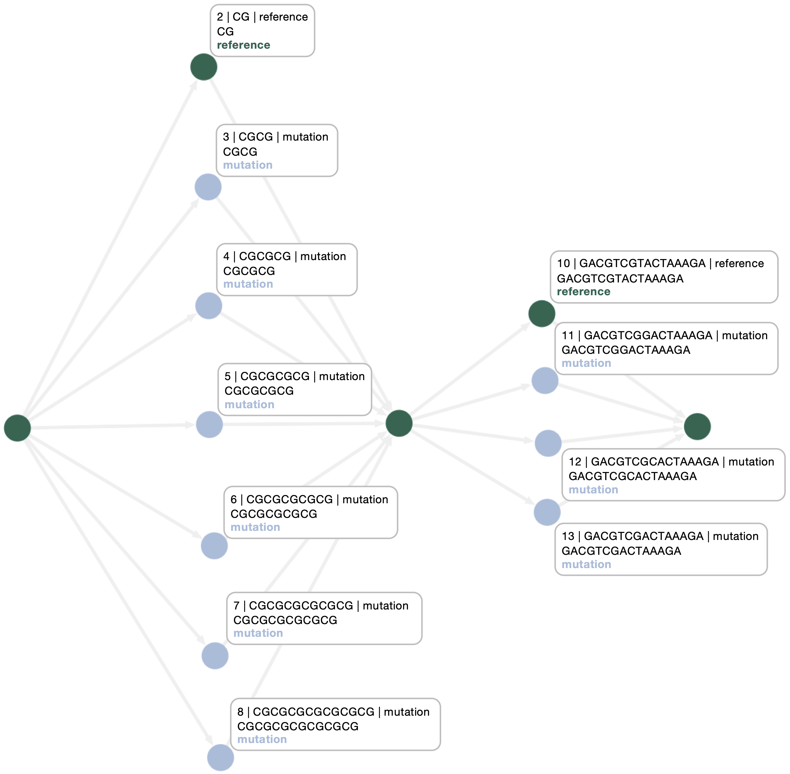
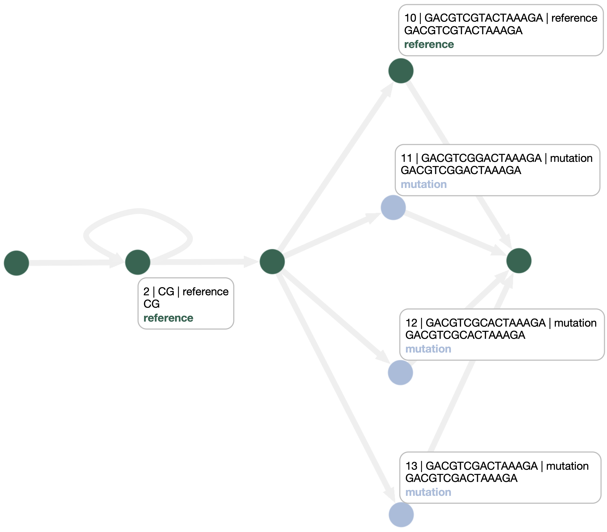

# PANPHORTE

PANPHORTE is a C++ command-line tool for topology optimization in pangenome graphs. It is designed to detect repeat-driven misrepresentations inside graph superbubbles and rewrite them into explicit cyclic structures, improving how Copy Number Variations (CNVs) and Variable Number Tandem Repeats (VNTRs) are represented.

In many pangenome graphs, repeated regions are encoded as alternative acyclic paths rather than as cycles. This can reduce graph interpretability, introduce redundancy, and negatively affect downstream analyses such as sequence-to-graph alignment. PANPHORTE addresses this issue by identifying shared repetitive elements across bubble traversals and refactoring the graph topology into a more compact and biologically faithful representation.

According to the accompanying work, this strategy can reduce graph redundancy, improve memory footprint, and support better exact matching during downstream alignment workflows.

## Features

- Detects repeat-driven misrepresentations in pangenome graph superbubbles
- Refactors repeated regions into explicit cyclic graph structures
- Preserves the represented sequence information
- Provides a lightweight C++ implementation
- Can be used as part of a broader graph optimization workflow together with GFAffix [1]

## Repository structure

```
Panphorte/
├── README.md
├── data
│   └── example.gfa
├── src
│   └── main.cpp
└── vendor
    └── json.hpp
```

## Requirements

To build PANPHORTE you need:

- A C++20-compatible compiler
- make
- BubbleGun

You can install BubbleGun with:
```
pip install BubbleGun
```

## Installation
Panphorte can be installed from source as follows:

```
git clone https://github.com/Mirkocoggi/Panphorte.git
cd Panphorte
make
```

## Usage

```bash
./panphorte -i <input.gfa> -o <output_dir> [--repeat_min_len <int>]
```

### Arguments

- `-i <input.gfa>`  
  Input pangenome graph in GFA format.

- `-o <output_dir>`  
  Output directory where the processed results will be written.

- `--repeat_min_len <int>`  
  Minimum length, in characters, of the repetitive element considered during detection.  
  Default: `1`.

## Examples

Run PANPHORTE on the example graph:

```bash
./panphorte -i data/example_1.gfa -o results
```

Run PANPHORTE with a custom minimum repeat length:

```bash
./panphorte -i data/example_1.gfa -o results --repeat_min_len 3
```

Visualization of the graph before and after applying Panphorte. The picture are generated with the [GenoGra](https://genogra.com/)'s Platform.

<table align="center">
  <tr>
    <td align="center">
      <br>
      <em>Original graph with CNV misrepresentation.</em>
    </td>
    <td align="center">
      <br>
      <em>PANPHORTE output with explicit cyclic representation.</em>
    </td>
  </tr>
</table>

## Notes

- Currently, PANPHORTE only works with haplotypes written as W-lines in the GFA. P-lines support is under development.
- The default value of `repeat_min_len` is `1`
- The project currently builds a single executable from `src/main.cpp`
- The `vendor/json.hpp` header is included locally through `-I./vendor`


## References
[1] GFAffix (https://github.com/codialab/GFAffix.git)
